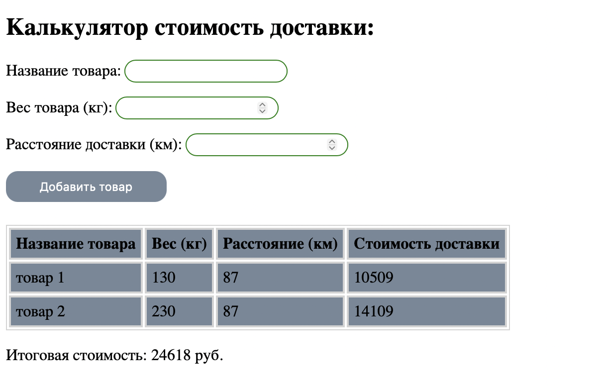

📦 Delivery Cost Calculator (Калькулятор стоимости доставки)

Простой и эффективный инструмент для расчета стоимости логистики. Сайт позволяет добавлять товары в список, автоматически вычислять стоимость доставки для каждой позиции и выводить общую сумму заказа.

🚀 Основные возможности:

- Динамическое добавление: Пользователь вводит название, вес и расстояние, и товар мгновенно появляется в таблице.

-Автоматический расчет: Стоимость вычисляется по формуле на основе веса и расстояния прямо в браузере.

-Итоговый баланс: Скрипт суммирует стоимость всех добавленных товаров и обновляет общую сумму в реальном времени.

-Интерактивная таблица: Использование семантических тегов <table> для структурированного вывода данных.

🛠 Технологии:

- HTML5: Формы ввода (input type="number", input type="text") и табличная верстка.

- CSS3: Стилизация интерфейса, работа с отступами и цветами для улучшения читаемости данных.

JavaScript (Vanilla JS):

- Сбор данных из полей формы.

- Математические вычисления на основе пользовательского ввода.

- Динамическое создание строк таблицы (insertRow, insertCell).

- Метод reduce или цикл для подсчета итоговой суммы.

📐 Формула расчета:

- В проекте реализована следующая логика (пример):

- Стоимость = (Вес * Коэффициент_веса) + (Расстояние * Коэффициент_расстояния)

📦 Как запустить:

- Клонируйте репозиторий.

- Откройте index.html в браузере.

- Введите данные товара и нажмите «Добавить товар».

💡 Чему я научилась в этом проекте:

- Валидировать данные из инпутов (проверка на пустые поля и отрицательные числа).
- Работать с DOM-деревом для динамического изменения контента без перезагрузки страницы.
- Преобразовывать строковые значения из полей ввода в числа (Number() / parseInt()) для корректных расчетов.

🔗Ссылка: [https://karinakit.github.io/-Delivery-Cost-Calculator/]

📸 
